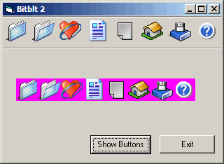



## BitBlt 2

### Description

Hi this is a little sample project I made that will show you how to add a strip of bitmaps to aimagelist control then add the new images to a toolbar. anyway not sure if this has been done before but I never seen it anyware. anyway I did this affter I noticed that many applications do the same thing but never figured how it worked so I desided to use bitblt that seem to work. anyway I hope that this code may be usfull for some one please vote if you like it.
 
### More Info
 

             |
---                |---
**Submitted On**   |2003-01-08 01:21:04
**By**             |[dreamvb](https://github.com/Planet-Source-Code/PSCIndex/blob/master/ByAuthor/dreamvb.md)
**Level**          |Beginner
**User Rating**    |4.6 (23 globes from 5 users)
**Compatibility**  |VB 4\.0 \(32\-bit\), VB 5\.0, VB 6\.0
**Category**       |[Custom Controls/ Forms/  Menus](https://github.com/Planet-Source-Code/PSCIndex/blob/master/ByCategory/custom-controls-forms-menus__1-4.md)
**World**          |[Visual Basic](https://github.com/Planet-Source-Code/PSCIndex/blob/master/ByWorld/visual-basic.md)
**Archive File**   |[BitBlt\_2152570182003\.zip](https://github.com/Planet-Source-Code/dreamvb-bitblt-2__1-42264/archive/master.zip)

